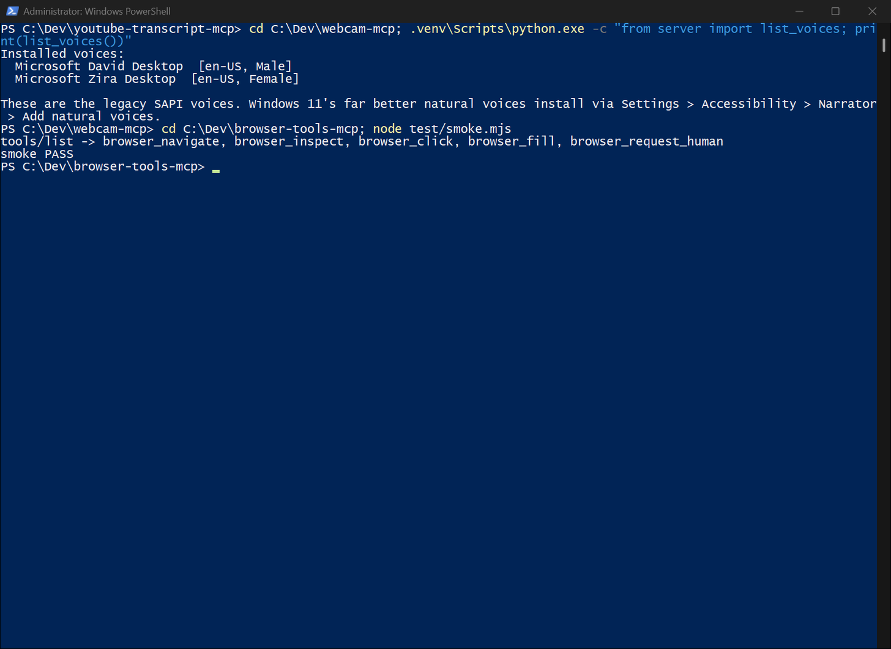

# browser-tools-mcp

Headed-Chromium browser control for OpenCode and Claude Code, in the Claude Code browser-tool style.

[](LICENSE)
[](https://github.com/luigimasango-dev/browser-tools-mcp/actions/workflows/ci.yml)
[](https://nodejs.org/)



## Quick start

Requires Node 24+ and network access (the verify scenario drives real
pages). Tested 2026-09-11 from a fresh clone on Windows 11:

```powershell
git clone https://github.com/luigimasango-dev/browser-tools-mcp.git
cd browser-tools-mcp
npm ci
node test/smoke.mjs
```

`node test/smoke.mjs` launches the real server over stdio, calls
`tools/list`, and asserts all five tool names — no browser window opens.
For the full headed scenario (navigate → inspect → click → fill →
crash-recovery, needs an interactive desktop):

```powershell
npm run verify
```

Verified 2026-09-11: example.com navigate/inspect/click, Google fill by
target, and relaunch-after-kill all pass; all five tools registered and
responded over the real MCP stdio protocol.

Register it with an MCP client (opencode.jsonc style):

```json
{
  "mcp": {
    "browser-tools": {
      "type": "local",
      "command": ["node", "C:\\Dev\\browser-tools-mcp\\server\\server.js"],
      "enabled": true
    }
  }
}
```

## How it works

Built 2026-08-05 because OpenCode had no native browser tool and
`custom-scraper` (plain HTTP) can't read JS-heavy or login-walled pages.

The MCP server process **is** the singleton browser manager. Because
OpenCode keeps the stdio server alive for the whole CLI session, the
browser survives across agent turns. If the browser crashes or the window
is closed, the next tool call transparently relaunches it
(`server/browser.js`).

Launch config: `headless: false`, `slowMo: 100`, viewport `1280x800`,
desktop Chrome UA, `--disable-blink-features=AutomationControlled`.

`browser_inspect` assigns each interactable element a numeric `target`,
tagged in the DOM as `data-bt-target` so later actions resolve the exact
same element. Elements are highlighted briefly before clicking so the user
sees the action.

## Tools

| Tool | Purpose | Key args |
|---|---|---|
| `browser_navigate(url)` | Load a URL; returns final URL + title | `url` |
| `browser_inspect()` | Screenshot + interactable element tree with numeric targets | — |
| `browser_click(target)` | Click by inspect number, CSS selector, or visible text | `target` |
| `browser_fill(target, value)` | Type into a field by number/selector/text | `target`, `value` |
| `browser_request_human(message)` | Pause flow and surface a question to the human. In stdio the tool returns a structured `awaiting_human` response (stdin is JSON-RPC framing, not the terminal) — the model must stop until the human answers | `message` |

## Limitations

- **Headed means a desktop.** The Chromium window needs an interactive
  session to launch; on a headless/disconnected box the launch fails.
- **Isolated browser.** This is NOT your logged-in Chrome (that's
  `chrome-bridge`). No logged-in sessions, no extensions, full write
  access.
- **Human-gated.** No logins, orders or sends without explicit
  instruction.
- CI runs only the stdio smoke test. The headed `_self_verify` scenario
  needs a display, so it stays a local command (`npm run verify`).

## Development

```powershell
npm ci
node test/smoke.mjs   # fast, headless-safe: tools/list over stdio
npm run verify        # full headed scenario, needs a display + network
```

Agent-facing rules live in `USAGE.md` (wired into OpenCode
`instructions`).

## Files

- `server/server.js` — MCP entrypoint, registers the five tools + schemas.
- `server/browser.js` — singleton browser/context/page manager + relaunch logic.
- `server/tools.js` — the operations (interactable tree, targeting, highlight, screenshots).
- `server/_self_verify.js` — standalone scenario test: `npm run verify`.
- `test/smoke.mjs` — CI smoke test: `tools/list` over stdio.
- `shots/` — screenshots from `browser_inspect` (git-ignored test artefacts).
- `USAGE.md` — agent-facing rules.

## License

MIT. See [LICENSE](LICENSE).
